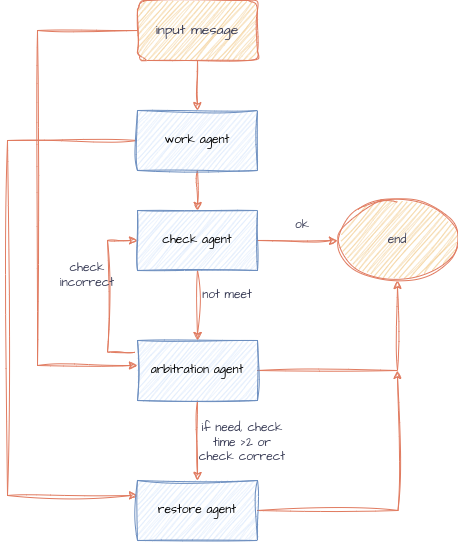

# Trinity

**Trinity** is a `compact agent team architecture` designed to reliably complete tasks while ensuring output quality. This worker-checker-arbitrator triad overcomes the limitations of single-agent systems where errors may go undetected.
If needed, it can be extended with a restorer.worker do the input task, and checker check the result, and arbitrator arbitrate the result. If needed, restorer restore the environment.  
This architecture is developed based on the [**Agno**](https://github.com/agno-agi/agno)

## Architecture

